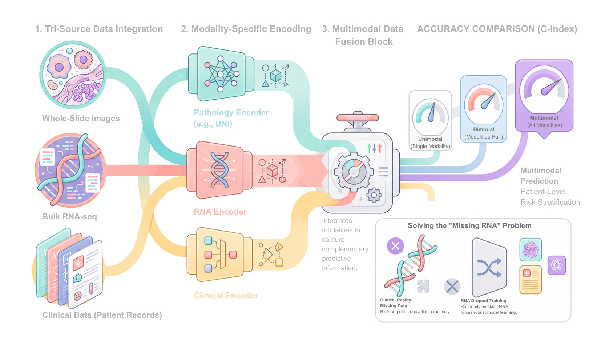
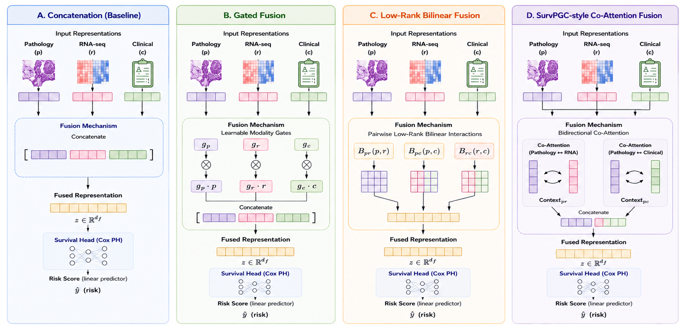

# Multimodal Survival Fusion

## Overview

A configurable PyTorch framework for multimodal survival prediction using histopathology, RNA-seq, and clinical data, with a systematic comparison of fusion strategies and robustness to missing RNA-seq.

<p align="center">
  
</p>

This repository provides a configurable benchmark for multimodal survival prediction of BCG progression in high-risk non-muscle-invasive bladder cancer (HR-NMIBC). It compares unimodal, bimodal, and trimodal models using histopathology whole-slide images, bulk RNA-seq, and clinical data.

The framework implements both embedding-based and token-based multimodal fusion strategies, including concatenation, scalar-gated fusion, low-rank bilinear fusion, and SurvPGC-style co-attention. It also supports multiple modality representations, including UNI pathology features, tabular and text-embedded clinical data, variance-filtered RNA, pathway and biological-category RNA tokens, and scFoundation embeddings.

To reflect clinical practice where RNA-seq is often unavailable, the framework includes RNA-dropout training and evaluates robustness under missing-RNA inference.

## Key Features

- Benchmark of unimodal, bimodal, and trimodal survival prediction models
- Comparison of embedding-based and token-based multimodal fusion strategies
- Support for pathology, bulk RNA-seq, and clinical data
- Multiple modality representations, including UNI, BioClinical ModernBERT, CONCH, and scFoundation
- RNA-dropout training for robustness to missing RNA-seq
- YAML-based experiment configuration for reproducible benchmarking
- Five-fold cross-validation with configurable training pipelines

## Supported Modalities
- WSI
- Bulk RNA-Seq
- Clinical data

### Pathology (WSI)

| Encoder | Representation | Shape |
|----------|---------------|--------|
| UNI | Tile embeddings | `[N_tiles, 1024]` |

### Bulk RNA-seq

| Encoder | Representation | Shape |
|----------|---------------|--------|
| scFoundation | Gene expression embeddings | `[4, 768]` |
| — | Raw gene expression | `[1, 19359]` |
| — | Pathway tokens | `[N_pathways, N_genes_per_pathway]` |
| — | Biological category tokens | `[6, N_genes_per_category]` |


### Clinical

| Encoder | Representation | Shape |
|----------|---------------|--------|
| — | Raw tabular | `[1, N_vars]` |
| BioClinical ModernBERT | ModernBERT text embeddings | `[5, 768]`  |
| CONCH text encoder | Text embeddings | `[5, 512]`  |


## Modality Representations

#### RNA-seq Embeddings ([scFoundation](https://github.com/biomap-research/scFoundation))

RNA-seq data were reduced in dimensionality by filtering genes using Hallmark and Reactome pathway collections. Only pathways with at least 90% gene coverage were retained, and the union of their genes was used as input to the scFoundation model. The resulting embeddings were used as RNA representations for downstream multimodal learning.

#### Clinical Text Embeddings ([BioClinical ModernBERT](https://github.com/lindvalllab/BioClinical-ModernBERT/tree/main) and [CONCH](https://github.com/mahmoodlab/CONCH))

Clinical variables were converted into natural language sentences before encoding. Each variable (e.g., age, sex, smoking status, tumor stage) was expressed as a descriptive sentence and encoded using BioClinical ModernBERT or the CONCH text encoder to generate contextual embeddings.

**Example:**

Structured input:

```
Age: 67
Sex: Male
Smoking history: yes/no
```

Converted text:

```
The patient is 67 years old.
The patient is male.
The patient has a history of smoking.
```

See [`resources/templates/clinical_embedding_sentence_templates.csv`](resources/templates/clinical_embedding_sentence_templates.csv) for the full clinical text templates.

## Models

The repository implements Cox proportional hazards models for unimodal, bimodal, and trimodal survival prediction using histopathology (P), bulk RNA-seq (R), and clinical (C) data.

| Configuration | Modalities | Supported fusion strategies |
|--------------|------------|-----------------------------|
| Unimodal | P, R, or C | Cox survival model |
| Bimodal | P+R, P+C, R+C | Concatenation, Scalar-Gated, Low-Rank Bilinear |
| Trimodal | P+R+C | Concatenation, Scalar-Gated, Low-Rank Bilinear, SurvPGC-style Co-Attention |

Unimodal models evaluate the predictive value of each modality independently. Bimodal models assess complementary information between modality pairs, while trimodal models integrate all three modalities for multimodal survival prediction.


## Fusion Strategies

| Fusion Strategy | Input | Description |
|-----------------|-------|-------------|
| Concatenation | Embeddings | Concatenates modality embeddings before Cox prediction. |
| Scalar-Gated | Embeddings | Learns patient-specific weights for each modality prior to fusion. |
| Low-Rank Bilinear | Embeddings | Models compact pairwise interactions between modalities. |
| SurvPGC-style Co-Attention | Tokens | Performs token-level cross-modal attention before survival prediction. |

<p align="center">
  
</p>

<p align="center">
  <em>Comparison of the four implemented multimodal fusion strategies.</em>
</p>

## Repository Structure


```text
multimodal-survival-fusion/
├── configs/
├── docs/
├── resources/
├── scripts/
├── src/
│   └── mm_survival/
│       ├── data/
│       ├── models/
│       │   ├── encoders/
│       │   └── fusion/
│       ├── training/
│       └── utils/
└── tests/
```

### Folder Overview

* `configs/data/`
  Dataset configuration files defining data locations, labels, modality inputs, embeddings, and external resources.

* `configs/experiments/`
  Experiment-specific configurations defining model architectures, fusion strategies, hyperparameters, and cross-validation settings.

* `scripts/`
  Entry-point scripts for training unimodal models, multimodal fusion models, SurvPGC-style models, and generating cross-validation folds.

* `src/mm_survival/`
  Core Python package containing data loaders, modality encoders, fusion modules, survival models, training pipelines, evaluation metrics, and utility functions.

* `resources/`
  Reusable resources including pathway databases, biological category definitions, and clinical text templates.


```
```

## Installation
## Dataset Format
## Configuration

Data locations, model architectures, fusion strategies, and training settings are controlled through YAML configuration files.

### How Configs Work

The repository separates dataset configuration from experiment configuration:

* `configs/data/` contains dataset-specific settings, including data locations, labels, embeddings, pathology features, and external resources.
* `configs/experiments/` contains experiment-specific settings, including model architecture, modality selection, fusion strategy, hyperparameters, and cross-validation settings.

This separation allows the same experiment configuration to be reused across different datasets and environments.

### Data Selectors

Several fields in the experiment configurations select among options defined in the data configuration:

* `label_name` selects the label file used for training and evaluation.
* `clinical_embedding_name` selects the clinical text embedding source (e.g., BioClinical ModernBERT or CONCH).
* `pathology_feature_name` selects the pathology feature set (e.g., UNI or PRISM).
* `omics_source` selects the omics representation used by SurvPGC-style models:

  * `pathway` – pathway-based RNA tokens
  * `category` – biological-category RNA tokens
  * `scfoundation` – precomputed scFoundation embeddings

### Experiment Configurations

| Config file                                | Model / fusion                           | Clinical input             | Omics / RNA input                           | Pathology input     |
| ------------------------------------------ | ---------------------------------------- | -------------------------- | ------------------------------------------- | ------------------- |
| `rna_unimodal.yaml`                        | RNA-only Cox                             | -                  | RNA expression with variance-filtered genes | -           |
| `clinical_unimodal.yaml`                   | Clinical-only Cox                        | Clinical text embeddings   | -                                    | -          |
| `pathology_unimodal.yaml`                  | Pathology-only Cox                       | -                   | -                                    | UNI tile embeddings |
| `concat.yaml`                              | Concatenation fusion                     | Tabular clinical variables | RNA expression with variance-filtered genes | UNI tile embeddings |
| `concat_clinical_embedding.yaml`           | Concatenation fusion                     | Clinical text embeddings   | RNA expression with variance-filtered genes | UNI tile embeddings |
| `gated_concat.yaml`                        | Gated concatenation fusion               | Tabular clinical variables | RNA expression with variance-filtered genes | UNI tile embeddings |
| `gated_concat_clinical_embedding.yaml`     | Gated concatenation fusion               | Clinical text embeddings   | RNA expression with variance-filtered genes | UNI tile embeddings |
| `lowrank_bilinear.yaml`                    | Low-rank bilinear fusion                 | Tabular clinical variables | RNA expression with variance-filtered genes | UNI tile embeddings |
| `lowrank_bilinear_clinical_embedding.yaml` | Low-rank bilinear fusion                 | Clinical text embeddings   | RNA expression with variance-filtered genes | UNI tile embeddings |
| `survpgc.yaml`                             | SurvPGC-style bidirectional co-attention | Clinical text embeddings   | Pathway-based RNA tokens                    | UNI tile embeddings |
| `survpgc_category.yaml`                    | SurvPGC-style bidirectional co-attention | Clinical text embeddings   | Biological-category RNA tokens              | UNI tile embeddings |
| `survpgc_scfoundation.yaml`                | SurvPGC-style bidirectional co-attention | Clinical text embeddings   | scFoundation RNA-seq embeddings             | UNI tile embeddings |


## Running Experiments

All experiments are run from the repository root using a data configuration file and an experiment configuration file.

### Unimodal Models

```bash
python3 scripts/train_unimodal.py \
  --experiment configs/experiments/rna_unimodal.yaml \
  --data configs/data/local.yaml
```

### Multimodal Fusion Models

```bash
python3 scripts/train_cv.py \
  --experiment configs/experiments/concat.yaml \
  --data configs/data/local.yaml
```

### SurvPGC-style Co-Attention Models

```bash
python3 scripts/train_survpgc.py \
  --experiment configs/experiments/survpgc.yaml \
  --data configs/data/local.yaml
```

To run a different experiment, replace the experiment configuration file with any configuration listed in the Configuration section.

## Results
## Citations
